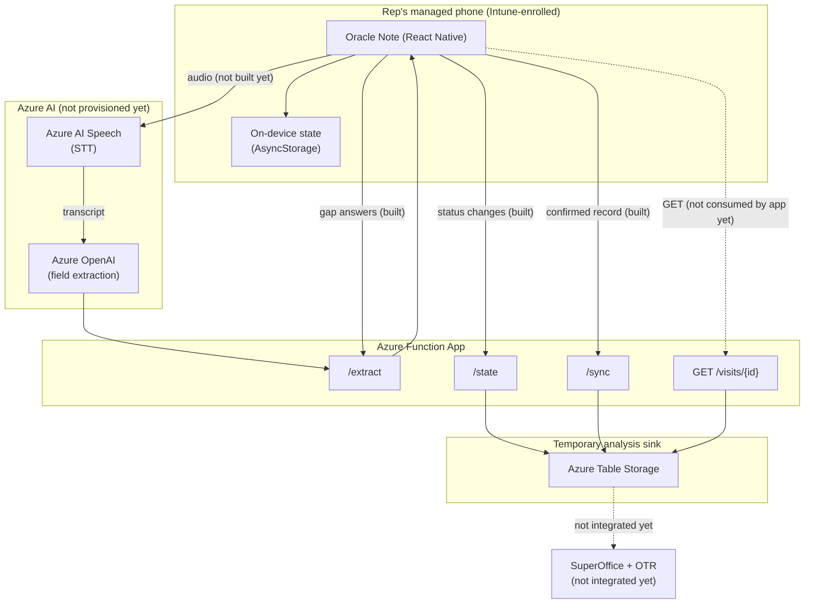

# Oracle Note — Architecture

**Status: parked.** The system this document describes is no longer the
active build target — see the top-level [`README.md`](README.md)'s
"Project direction" for why (CRM integration turned out to be fully out of
scope, and hands-free-while-driving turned out not to be a hard
requirement; the active path forward is a Copilot Studio agent, spec'd
separately). Everything below is accurate as of when work paused, kept as
the honest record of what was real versus mocked at that point, and as the
starting reference if CRM integration brings this system back into scope.

This document exists to support a resourcing decision: what Oracle Note is
built to become, what of that exists today, what's mocked in its place, and
what a live pilot actually needs from the organization (Azure subscription
access, Entra tenant actions, and — separately — CRM integration
documentation) to move past this point. It complements, not replaces,
[`app/README.md`](app/README.md) and [`backend/README.md`](backend/README.md),
which document the code itself in more detail.

## Context

Oracle Note is a voice-first debrief tool for field sales reps (piloted
against Bufab's own C-parts/fasteners trading context): a rep speaks a
free-form monologue in the car right after a customer visit, Oracle asks a
small number of follow-up questions to close known gaps (decision maker,
next step, and one optional question), and the result stages as structured
fields the rep confirms before it syncs onward — replacing after-the-fact
CRM form-filling with something that happens in the two minutes right after
the visit, hands and eyes free until the phone comes out.

The flow itself comes from a design handoff bundle
([`design/`](design)) that was reviewed and scoped down to a single
decided flow (see [`app/README.md`](app/README.md)'s "Scope" section). What
exists today is a working React Native app implementing that flow end to
end against one fixed demo visit, a backend API scaffold behind it, and two
standalone walkthrough/demo artifacts for showing it without installing
anything. None of it has been tested against a real Azure tenant, a real
device fleet, or real CRM data — that's what this document scopes.

## Problem

Two problems, one document:

1. **The product problem** Oracle Note addresses: debrief data that lives
   in a rep's head decays fast, and the existing path to capturing it (a
   CRM form, filled in later, if at all) has enough friction that a lot of
   it never gets captured. The bet is that voice, in the two minutes right
   after a visit, has near-zero friction by comparison.
2. **The problem this document solves**: before anyone can approve
   resourcing for a live pilot, they need an honest picture of what's
   already real, what's still a stand-in, and what specifically is being
   asked for (an Azure subscription/resource group, Entra tenant actions,
   and CRM integration documentation) — not a vague "we need Azure access."

## Proposed design

Target topology once fully built out:

Solid arrows in the diagram above are wired and verified in this build;
dotted arrows and the two "not provisioned/integrated yet" subgraphs are
target-state only. See "What's mocked vs real today" below for the
unambiguous version of this same claim, field by field.

## Key components

| Component | State today | What makes it real |
|---|---|---|
| RN app (iOS/Android) | Built, UI-complete, one fixed demo visit | Already real |
| Local save-and-resume (`AsyncStorage`) | Built, real | Already real |
| Backend API (Azure Functions) | Built, verified locally (see `backend/README.md`) | Deploy via `infra/main.bicep`; not deployed anywhere yet |
| Extraction (`/extract`) | Built, deterministic pass-through (`PassthroughExtractionProvider`) | Needs Azure OpenAI tenant + tested extraction prompt |
| Temporary analysis sink | Built, verified against Azurite locally | Deploy `infra/main.bicep`'s Storage account |
| Remote state mirror (`/state`) | Built, best-effort, fire-and-forget | Already real once deployed; consider a retry/confirm path before treating it as durable (see Risks) |
| Real audio capture | Not built | Next workstream (see `app/README.md`) |
| Speech-to-text | Not built | Needs Azure AI Speech resource + real audio capture first |
| Voice trigger commands ("Oracle, start/stop…") | Simulated via a labeled DEV button | On-device speech recognition, planned next (fallback button stays per the decision to keep a manual override) |
| Entra ID SSO (MSAL) | Scaffolded, unconfigured, untested against a real tenant | Real App Registration + redirect URIs + a development build (see `app/README.md`'s "Sign-in / MDM") |
| Backend API auth | **None — every route is `authLevel: 'anonymous'`** | See Risks below; needs its own App Registration exposing a scope the app's MSAL token can request |
| SuperOffice/OTR (real CRM) | Not integrated; unknown API surface (proprietary "OTR" overlay) | Needs documentation from whoever owns OTR — out of scope until that exists |
| CarPlay / Android Auto | Not built; in-app frame stands in | Separate native extensions per platform; deferred by design (see `app/README.md`) |

## Data flow

Walking one debrief end to end, marking what's real (●) vs mocked (○):

1. Rep says "Oracle, start debrief" (○ — DEV button today) → car screen shows Recording.
2. Rep speaks a monologue (○ — no real audio capture yet).
3. Rep says "Oracle, stop" (○ — DEV button) → app persists `status: recorded` locally (●) and best-effort mirrors it to the backend's `/state` (●, if deployed).
4. Oracle asks 1–3 follow-up questions (○ — fixed authored copy, not derived from the monologue, since there's no real transcript to derive gaps from yet).
5. Rep answers (○ — fixed authored replies stand in for real speech input).
6. On reaching Staged, the app calls the backend's `/extract` (●) with the two mandatory gap answers; the backend's `PassthroughExtractionProvider` (○ — deterministic, not real NLU) returns them as staged fields, which render alongside the still-static "extracted" fields (Stage, Volume, Risk flagged) that would, in a real system, also come from the monologue's transcript (○).
7. Rep taps "Confirm & sync" → app persists `status: synced` locally (●), mirrors it (●), and POSTs the full record to the backend's `/sync` (●), which the sink persists for real (●, if deployed).
8. The Synced screen's four "written to CRM" rows are illustrative copy (○) — nothing writes to SuperOffice/OTR; the sink holds the debrief data for analysis, not for CRM writeback, matching the earlier scoping decision to keep the pilot's sync target a temporary, inspectable store rather than the real CRM.

## Governance and security

- **Device posture**: the fleet is fully Intune-enrolled (not BYOD), with
  always-on, self-reasserting VPN and device compliance handled by MDM —
  this app doesn't need to implement either. See `app/README.md`'s
  "Sign-in / MDM" section for the full reasoning; the short version is that
  MDM covers the device, but SSO is app-specific and needs its own Entra
  App Registration (MSAL), which is built but unconfigured.
- **Backend authentication is currently open.** Every route in
  `backend/src/functions/` uses `authLevel: 'anonymous'`. This is
  acceptable only because the backend isn't deployed anywhere reachable
  yet and holds no real data. It must not go live behind a public URL in
  this state — see Risks below.
- **CORS defaults to `*`** in both the backend code (`CORS_ALLOWED_ORIGIN`
  env var) and the Bicep template. Same reasoning: fine while nothing is
  deployed, needs tightening before it is.
- **Transcript/audio retention claims in the UI are ahead of the code.**
  The Staged screen's copy says "Transcript kept; audio deleted after
  transcription" — that's the intended real-system behavior, written into
  the design and carried into this build's copy, but there is no real audio
  pipeline yet for that claim to be true of. Worth flagging explicitly so
  it isn't mistaken for an implemented data-retention guarantee.
- **Secrets**: none exist in this codebase (all Azure OpenAI / Storage
  values are empty placeholders, gitignored where they'd be set locally).
  `infra/README.md`'s "Production hardening not done here" section flags
  that once real keys exist, they belong in Key Vault, not plain Function
  App settings — deliberately not built yet, since there's no key to
  protect.

## Risks and trade-offs

- **Backend has no authentication.** Highest-priority real gap — must be
  closed (Entra App Registration for the API + validated tokens, not
  `anonymous`) before any real data reaches it.
- **Extraction is not real NLU.** `PassthroughExtractionProvider` proves
  the pipe, not the intelligence. Actual field-quality extraction depends
  on an Azure OpenAI tenant, a tested prompt, and — realistically — several
  rounds of comparing extracted output against what reps actually said,
  which hasn't happened and can't happen without real transcripts.
- **The remote state mirror is fire-and-forget, not confirmed.** A status
  change that fails to mirror (backend briefly unreachable, for instance)
  is silently only local. Fine for a pilot's blast radius; a production
  build should confirm or retry before calling a status change durable.
- **Voice trigger reliability is untested.** On-device speech recognition
  in a moving car — background noise, wake-phrase false positives/negatives
  — is a real open question, not a solved one. The plan (see
  `app/README.md`) is to build it with the manual DEV-button fallback
  intact specifically because of this risk, not despite it.
- **One fixed demo dataset throughout.** Every verification in this build
  (RN app, backend harness, end-to-end Playwright pass) exercises the same
  Bergman Maskin AB visit. That's sufficient to prove the mechanism works;
  it says nothing about how the app or the extraction step behaves against
  the variety of real visits a live pilot would produce.
- **SuperOffice/OTR is a complete unknown.** No API documentation for the
  proprietary "OTR" overlay has been available to this build. The temporary
  analysis sink exists specifically so this gap doesn't block a pilot —
  but real CRM integration is unscoped work that starts only once that
  documentation exists.
- **MSAL is untested against a real tenant, a real signed build, or a real
  device.** See `app/README.md`'s own limitations section — the code is
  correctly shaped against the SDK's real types, not guessed, but "correctly
  shaped" and "tested" are different claims.

## Alternatives considered

- **Azure Functions vs. a plain Node/Express service.** Functions was
  chosen for consumption-based billing (near-zero idle cost for a pilot),
  and because it's the platform-native choice for an Azure-hosted,
  event-driven API — preferring platform capabilities over introducing a
  separate hosting model was a deliberate call, not a default.
- **Temporary analysis sink vs. syncing straight to SuperOffice/OTR.**
  Already decided earlier in this project (see `backend/README.md`): with
  no OTR API documentation available and a pilot phase that needs
  inspectable output rather than live CRM writes, a temporary sink is the
  lower-risk choice. Revisit once OTR access exists.
- **In-app car frame vs. real CarPlay/Android Auto extensions.** Also
  already decided (see `app/README.md`): real native extensions are
  separate per-platform projects with their own entitlement/approval
  processes; deferred past the pilot on purpose, not by oversight.

## What's mocked vs real today

A single unambiguous reference, since claims about "real" architecture are
easy to overstate:

**Real, verified in this build:**
- The full RN app UI/interaction flow, including local save-and-resume.
- The backend API's four endpoints, request/response contracts, and both
  provider interfaces' local/mock implementations.
- `AzureTableSinkProvider` — verified against Azurite, not just written.
- The app-to-backend wiring (extraction call, sync call, state mirror),
  verified over real HTTP via a genuine browser build of the app, which
  caught and fixed two real bugs (CORS, a path bug) that isolated backend
  testing alone did not surface.

**Real code, inert until configured (same pattern throughout):**
- MSAL/Entra SSO (`app/src/auth/`).
- `AzureOpenAiExtractionProvider` (`backend/src/providers/extractionProvider.ts`).
- The backend itself, until deployed via `infra/main.bicep`.

**Not built at all yet:**
- Real audio capture, speech-to-text, on-device voice trigger recognition.
- Backend authentication.
- SuperOffice/OTR integration.
- CarPlay/Android Auto native extensions.

## What a live pilot actually needs

Concretely, from the organization, to move past this point:

1. **An Azure subscription and resource group** to deploy
   `infra/main.bicep` into (Function App, Storage, Application Insights —
   see `infra/README.md` for the approximate cost shape).
2. **An Entra tenant admin action**: two App Registrations — one for the RN
   app's MSAL sign-in, one for the backend API itself (currently missing
   entirely) — plus redirect URIs and, ideally, a decision on whether
   Conditional Access should gate this on device compliance.
3. **Azure OpenAI access** (region/model approval and quota) once ready to
   move `AzureOpenAiExtractionProvider` from placeholder to real — not
   needed to deploy the rest.
4. **SuperOffice/OTR documentation**, from whoever owns that integration
   internally — the one dependency this document cannot scope further
   without it.
5. **A handful of pilot devices** — already covered by the existing
   Intune-managed fleet, per the MDM discussion in `app/README.md`.

None of the above is needed to keep developing against the mocked/local
defaults this build already runs on. It's needed specifically to take the
step from "as far as this environment could take it" to a live test with
real reps.
